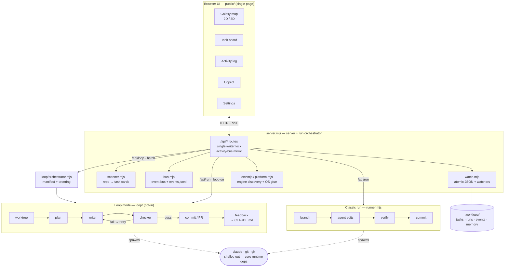

# Workloop

**Local mission control for your repo.** Workloop scans any project into task
cards, and each card's **Run** fires a headless [Claude Code](https://code.claude.com/docs)
fix‑loop that works until your verifier passes — then hands you a committed
branch (and, if you want, a real PR). The whole repo is a live **galaxy** map:
every file a star, every agent run a comet.

**Zero npm dependencies.** Runs on Node alone and shells out to the `claude`,
`git`, and (optionally) `gh` you already have. **macOS and Windows are
first‑class; Linux is best‑effort.**

```
                    ┌──────────────────────── HUD ────────────────────────┐
                    │ ☰  WORKLOOP  ⎇branch  2D/3D  search  ext-chips   ☷ │
   ┌── control ──┐  ├──────────────────────────────────────────────────────┤  ┌─── work ───┐
   │ repo picker │  │                                                      │  │ TASKS      │
   │ branches    │  │                  THE GALAXY                          │  │  needs work│
   │ run locally │  │        every file a star, every run a comet         │  │  queue     │
   │ commands    │  │     uncommitted work pulses until you commit        │  │ ACTIVITY   │
   │ engine      │  │                                                      │  │  live log  │
   │ loop mode   │  │                                                      │  │ COPILOT    │
   │ themes ×16  │  │                                                      │  │  chat +    │
   └──── [ ──────┘  └──────────────────────────────────────────────────────┘  │  handoffs  │
                                                                              └──── ] ─────┘
```

---

## How it works

1. **Scan.** `scanner.mjs` reads your repo and turns problems into **task
   cards** — failing typecheck/tests/lint/build (your configured *verifier*
   commands), `TODO`/`FIXME` comments, unchecked `BACKLOG.md` goals, and
   agent‑fixable *findings* surfaced by the copilot.
2. **Run.** Click **Run** on a card. Workloop branches, invokes the Claude Code
   engine **headlessly** in your repo (tight tool scope, capped turns, a
   wall‑clock budget), and the agent edits until the work is done.
3. **Gate.** Workloop independently re‑runs your verifier — *a card can't lie*.
   A failed run discards its partial edits so your tree stays clean.
4. **Hand off.** It commits to a branch with a conventional message. Turn on
   *open a PR after each run* and you get a real PR link on the card. It
   **never merges, deploys, or migrates** — that stays your click.

Two run modes share one engine (pick in **Settings → Loop engineering**):

- **Classic** *(default)* — one agent → verify → commit. Fast and simple.
- **Loop engineering** *(opt‑in)* — orchestrator → isolated git worktree →
  written **plan** → **writer** → a **separate adversarial checker** that
  reviews the diff and sends it back on failure → reviewed branch + feedback to
  memory. See [Loop engineering mode](#loop-engineering-mode).

### Architecture



The browser talks to `server.mjs` over HTTP + Server‑Sent Events. The server
scans the repo, holds a **single‑writer lock** (one agent at a time, even across
two Workloop instances on the same checkout), mirrors everything to a live
**activity bus**, and spawns the run path you chose. Both run paths shell out to
the real `claude`, `git`, and `gh` binaries — nothing is bundled.

---

## Setup

### Prerequisites (all platforms)

| Need | Why |
|---|---|
| **Node.js 18+** | Workloop itself ([nodejs.org](https://nodejs.org)) |
| **Claude Code CLI**, signed in | the engine each Run drives |
| **git** | branching + commits |
| **GitHub CLI (`gh`)** *(optional)* | one‑click PRs |

After installing the Claude CLI, **sign in once**: run `claude`, complete the
browser login (or type `/login`). Workloop auto‑discovers the binary on your
login PATH and the common install locations.

### macOS

```bash
# 1. Claude Code CLI  (native installer — auto-updates)
curl -fsSL https://claude.ai/install.sh | bash
#    …or:  brew install --cask claude-code

# 2. git  (if not already present)
xcode-select --install        # or: brew install git

# 3. gh (optional, for PRs)
brew install gh               # then: gh auth login

# 4. sign in to the engine, then verify
claude                        # complete browser login, then exit
claude --version && which claude
```

Launch Workloop: **double‑click `start.command`** (first time: right‑click →
**Open** — Gatekeeper blocks downloaded scripts on a normal double‑click), or
run `npm start` in the folder.

### Windows (Command Prompt / `cmd.exe`)

```bat
:: 1. Claude Code CLI  (run in cmd.exe, NOT PowerShell)
curl -fsSL https://claude.ai/install.cmd -o install.cmd && install.cmd && del install.cmd
::    …or:  winget install Anthropic.ClaudeCode

:: 2. git for Windows  (gives Claude a Bash to use)  — https://git-scm.com/downloads/win
::    …or:  winget install Git.Git

:: 3. gh (optional, for PRs)
winget install GitHub.cli

:: 4. sign in to the engine, then verify
claude
claude --version
where claude
```

> The native installer fetches the binary for you (no manual download) and adds
> it to your PATH. If `cmd` later says `'claude' is not recognized`, close and
> reopen the window; if it persists, add the folder from `where claude` to your
> **PATH** (System Properties → Environment Variables) and reopen `cmd`.

Launch Workloop: **double‑click `start.cmd`**, or run `npm start` in the folder.

### First run (either OS)

The control center opens itself if no repo is set. Click **Browse…** to pick a
folder (or **Find repos on this machine** and click one), hit **Save & scan**,
then **Run** a task card. Port busy? `PORT=4318 npm start` (default is `4317`).

---

## Loop engineering mode

The classic Run is one agent doing everything, gated only by your verifier's
exit code. **Loop mode** upgrades every Run into the pattern Anthropic uses
internally — *agents orchestrating agents, with a checker that always reviews
the writer* — and it's entirely button‑driven.

**Turn it on:** **Settings → Loop engineering → enable loop mode**. From then on:

- Every card's **Run** routes through the full pipeline below.
- A **⟳ Loop board** button (it replaces *Run all*) runs the **orchestrator**
  across the whole board: it reads repo state + prior runs, writes a *manifest*,
  orders tasks, defers ones that keep failing, then drives a worker per task.

What each task goes through:

| Stage | What happens |
|---|---|
| **Worktree** | the task runs in its own throwaway `git worktree` off `HEAD` — your working tree is never touched, and `node_modules` is linked in so verifiers work |
| **Plan** | a read‑only agent writes a plan (files, approach, risks) *before* any edit — the checkpoint |
| **Writer** | an agent implements the plan inside the worktree and commits |
| **Checker** | a **separate process** with read‑only tools and an adversarial prompt reviews the diff — `node --check`, your verifiers, an "find what's wrong" pass, adjacent‑file regressions. On failure its notes go back to the writer and it **retries** (up to *max retries*) |
| **Feedback** | the outcome is appended to `CLAUDE.md` (Run Log / Known Mistakes / Lessons) so the next run is smarter |

It still only ever produces a **reviewed branch** (or PR) — never a merge.
Everything is configurable in the same Settings section (worktree isolation,
auto‑approve plan, max retries, dirs to link, teardown‑on‑fail).

> **Why opt‑in?** Loop mode roughly triples agent calls per task and depends on
> worktree dependency‑linking, so it ships **off**. Flip one toggle to enable.

Power users can drive the same layers from the CLI: `npm run loop -- orchestrate`,
`npm run loop -- run <taskId>`, `npm run loop -- check`, `npm run loop -- worktree …`.

---

## The galaxy

Your repo as a living map — directories are hubs, files are stars sized by bytes
and colored by type. Two renderers, one click apart: the flat radial **2D** map
and a WebGL2 **3D** galaxy (spiral / shells / clusters layouts, bloom, god rays
— all tunable in **3D scene**).

- **Search** (`/` or `⌘K`) fuzzy‑finds any file and flies the camera to it.
- **Click a file / right‑click anything** → the node menu: **Peek** (first 120
  lines inline), **History** (recent commits), Open in editor, Reveal, Copy
  path, **Pin**, **Focus subtree**, **Queue a goal**, **Ask Copilot** — plus a
  shortcut to any open task on that file.
- **heat** recolors by commit recency; extension chips spotlight a language.
- **Uncommitted changes pulse** — files you haven't committed breathe and emit a
  light‑bending ripple (tune or disable under **Appearance → Uncommitted ping**).
- While an agent works you see it live: amber pulses on the files being edited,
  light streaming along their paths, a green firework when a run lands.

## The drawers

**Right `]` — work panel.** **Tasks** (verified ✓ checks plus queued goals),
Run / Run all / **Loop board** / discard. **Activity** — one live stream of
scans, runs, git, dev output, chat; filter chips; survives reloads. **Copilot**
— chat about the repo with read‑only tools (safe mid‑run); things needing *your*
hands arrive as **handoff cards** with numbered steps and copy buttons.

**Left `[` — control center.** **Repo picker**, **Branches** (switch / create /
commit with an AI‑written message / discard / merge → main / **Push ↑n / Sync
↓n / Open PR**), dev command, saved commands, **Engine & agent**, **Loop
engineering**, verifier commands, and **Appearance** (sixteen themes, ambient
weather, graphics quality, the uncommitted‑ping tuner).

## GitHub, not just local

- The HUD branch chip shows `±n` uncommitted and `↑n` unpushed at all times.
- **Push** publishes the current branch. **Sync** pulls fast‑forward‑only.
  **Open PR** pushes if needed, then `gh pr create --fill` — or, without `gh`,
  opens GitHub's compare page.
- **push after each Commit** turns Commit into commit+push; **open a PR after
  each run** ends every agent run with a real PR link on its card.

## Engine & models

Pick the engine in **Engine & agent**: binary path (auto‑discovered), **model
picker** (Fable 5, Opus 4.8, Sonnet 4.6, Haiku 4.5, or CLI default), **effort**
(shown only when your CLI supports it), and free‑form extra flags — the composed
command is previewed live and used for runs, chat, and AI commit messages alike.

## How a Run works (classic path)

1. Refuses to start on a dirty tree, and refuses to run unless it landed on the
   work branch.
2. Creates a branch `workloop/<source>-<slug>-<id>`.
3. Invokes the engine headlessly with a tight tool scope, capped turns, and a
   wall‑clock budget; the agent edits and runs your verifier itself.
4. **Independent gate:** Workloop re‑runs the verifier. On failure (or timeout)
   it discards partial edits so the next run isn't blocked. Cards with no check
   (findings, TODOs, backlog) commit but are flagged *not independently verified*.
5. Commits with a conventional message; with `openPR` on → push + `gh pr create`.

One writer at a time by design (runs, saved commands, and write‑chat exclude
each other — across both instances sharing the checkout).

## Files & configuration

- `server.mjs` — dashboard + API + run orchestrator; serves `public/` fresh
- `runner.mjs` — the classic one‑agent run path
- `loop/` — the loop‑engineering layer: `orchestrator` · `pipeline` · `worktree`
  · `plan` · `checker` · `feedback` · `memory` · `agent` (shared engine core) ·
  `cli` · `babysitter`
- `scanner.mjs` — repo → task cards · `cards.mjs` — one definition of card shape
- `bus.mjs` / `chat.mjs` / `handoffs.mjs` / `findings.mjs` / `commands.mjs`
- `watch.mjs` — atomic writes + cross‑instance watchers · `env.mjs` — engine
  discovery · `platform.mjs` — every OS‑specific behavior
- `CLAUDE.md` — conventions + the loop's persistent memory (Run Log)
- `workloop.config.json` — your settings (auto‑created, personal, gitignored) ·
  `.workloop/` — local state (tasks, runs, events, chat, plans, manifest)

## Developing Workloop

Still zero runtime dependencies — its own checks are built the same way:

- `npm run lint` — `node --check` over every source file (server + browser bundle).
- `npm test` — the [`node:test`](test/) suite covering the pure parsers/helpers.
- `npm run check` — both; this is the verifier to point Workloop at itself.

**Dogfood it:** copy [`workloop.config.sample.json`](workloop.config.sample.json)
to `workloop.config.json`, set `repoPath` to this checkout, and let Workloop fix
Workloop. The server is **localhost‑only by design** (binds `127.0.0.1`, rejects
non‑loopback `Host` / cross‑origin requests) — a Run can execute shell commands,
so keep it that way.

## Platform notes

- **macOS** — Gatekeeper: right‑click → Open the first time. If repo discovery
  skips Desktop/Documents, grant your terminal Files access in System Settings →
  Privacy.
- **Windows** — install via `cmd.exe`, not PowerShell. The native `claude.exe`
  is preferred; npm's `claude.cmd` shim also works (Workloop resolves it safely
  — prompts never pass through `cmd.exe`). Saved commands and verifiers run under
  `cmd.exe`, so write them in cmd syntax.
- **Linux** — `npm start`. The folder picker needs `zenity`; engine sign‑in
  prints the command to run in your own terminal.

## Troubleshooting

- **Engine: claude not found** — set the full path in Engine & agent → Recheck.
- **Not signed in** — the Sign in button opens a terminal with `claude /login`.
- **"working tree has uncommitted changes"** — Commit or Discard in Branches (a
  failed run cleans up after itself, so this usually means edits that are yours).
- **Loop run skipped the verifier** — a fresh worktree couldn't link
  `node_modules`; the branch is left for you to verify. Check the *link dirs*
  setting, or run that repo's classic path.
- **Push rejected** — Sync first (fast‑forward only), then Push.
- **3D galaxy is black** — WebGL2 unavailable; the 2D map keeps working.

## API sketch

`/api/tasks` `/api/scan` `/api/status` `/api/config` `/api/detect` `/api/backlog`
`/api/task/discard` — board · `/api/run?id=` (SSE) — classic or loop run ·
`/api/loop[?ids=…]` (SSE) — orchestrated batch · `/api/events` (SSE) — activity
bus · `/api/chat` (NDJSON) `/api/chat/history|reset` ·
`/api/handoffs[/resolve|dismiss]` · `/api/commands/run|stop|status` ·
`/api/git/state|switch|branch|commit|merge|discard|push|sync|pr|log` ·
`/api/repos[?find=1]` `/api/pickfolder` · `/api/dev/start|stop|status` ·
`/api/repotree[?heat=1]` `/api/file` — galaxy data + peek · `/api/open`.

## License

MIT — see [LICENSE](LICENSE).
